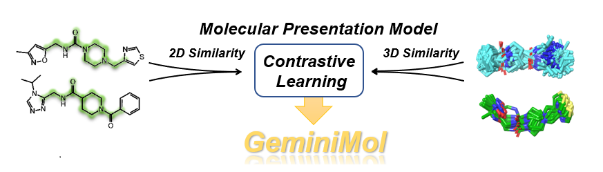

# GeminiMol

  

This repository provides the official implementation of the GeminiMol model, training data, and scripts.  

We also provide:   

1.  Scripts for data collection and analysis.    
2.  A benchmark script and datasets for virtual screening, target identification, and QSAR (drug-target binding affinity, cellar activity, ADME, and toxicity).   
3.  Benchmark results of molecular fingerprints and GeminiMol models.   

_Please also refer to our paper for a detailed description of GeminiMol._

## Motivation  

_The **molecular representation model** is an emerging artificial intelligence technology for extracting features of small molecules. It has been **widely applied in drug discovery scenarios**, such as **virtual screening**, Quantitative Structure-Activity Relationship (**QSAR**) analysis, and **molecular optimization**._   
  
_In previous work, molecular representation models were mostly trained on the static structure of molecules, however, the small molecules in solution are highly dynamic, and their flexible conformational changes endow them with the potential to bind to drug targets. Therefore, introducing information on small molecule conformational space into molecular representation models is a promising aim. In this work, a training strategy, named GeminiMol, was proposed to **incorporate the comprehension of conformational space into the molecular representation model**._   

_The similarity between small molecules provides the opportunity for contrastive learning, as illustrated in followed figure, the shape similarity contained more pharmacological and physical information than the 2D structure and fingerprint similarity, therefore, **introducing the molecular shape similarity in contrastive learning is a promising strategy**._


_In this study, a diverse collection of **39,290** molecules was employed for conformational searching and shape alignment to generate a comprehensive dataset of molecular conformational space similarity. Various hyperparameters were employed during the conformational search process, and a multi-task learning approach was adopted to facilitate the model in acquiring a universal representation of molecular conformational space. To assess the model's performance, the **benchmark datasets comprising over millions molecules** was utilized for downstream tasks._    

## Application

_As a potent molecular representation model, GeminiMol finds applications in **ligand-based virtual screening, target identification, and quantitative structure-activity relationship (QSAR)** modeling of small molecular drugs. Moreover, by exploring the encoding space of GeminiMol, it enables **scaffold hopping** and facilitates the generation of innovative molecules._   


_To ensure the accurate evaluation of the model's performance, we have additionally devised a competitive-performance baseline method utilizing molecular fingerprints. This baseline method has demonstrated competitive performance compared to state-of-the-art traditional methods in the application tasks. GeminiMol has demonstrated comparable or even superior performance compared to the current state-of-the-art baseline method in various statistical metrics across these tasks. Furthermore, it demonstrates a remarkable ability to attain balanced superior performance across multiple diverse tasks **without the necessity of additional fine-tuning or hyperparameter readjustment**._

## Installation

_GeminiMol is a python-based AI model. To set up the GeminiMol model, we recommend using conda for Python environment configuration._   

> install MiniConda
```
    wget https://repo.continuum.io/miniconda/Miniconda3-latest-Linux-x86_64.sh
    sh Miniconda3-latest-Linux-x86_64.sh
```
> create GeminiMol env
```
    conda create -n GeminiMol python=3.8.16
    conda activate GeminiMol
```
> download GeminiMol and configuration
```
    git clone https://github.com/Wang-Lin-boop/GeminiMol
    cd GeminiMol/
    export PATH=${PWD}:\$PATH" >> ~/.bashrc
    export GeminiMol=${PWD}" >> ~/.bashrc
    cd geminimol/
    export geminimol_app=${PWD}" >> ~/.bashrc
    cd ../model
    export geminimol_lib=${PWD}" >> ~/.bashrc
    source ~/.bashrc
```

#### Baseline Fingerprint Methods and Benchmark Protocol

_If you intend to utilize molecular fingerprint baseline methods or conduct QSAR benchmarking, it is required to install RDKit and AutoGluon in advance._     

> Installing the RDkit for generating fingerprints

```
    pip install rdkit
```

> Installing the AutoGluon for performing QSAR

``` 
    pip3 install -U pip
    pip3 install -U setuptools wheel
    pip3 install torch==1.13.1+cu116 torchvision==0.14.1+cu116 \
        --extra-index-url https://download.pytorch.org/whl/cu116
    pip3 install autogluon==0.7.0
```

> Installing the statatics and plot packages

```
    pip install oddt scikit-learn matplotlib umap-learn
```

#### GeminiMol models

_In this repository, we provide over 30 million pairs of training, validation, and testing data used in our paper, as well as an optimal GeminiMol binary-encoder model, a series of CSS similarity decoder models, a molecular structure decoder model, and a variety of decoder models of basic ADMET properties. To re-train the model or make predictions using the models we provide, follow the steps below to install the dependencies in advance._

```
    pip install rdkit scipy dgllife scikit-learn
    pip install torch==1.13.1+cu116 torchvision==0.14.1+cu116 \
        --extra-index-url https://download.pytorch.org/whl/cu116
    pip install dgl -f https://data.dgl.ai/wheels/cu116/repo.html
    pip install dglgo -f https://data.dgl.ai/wheels-test/repo.html
```

## Running GeminiMol


#### Virtual Screening 

#### Target Identification

#### QSAR

#### Molecular Generation


## Citing this work

_coming in soon...._

## Acknowledgements

_We appreciate the technical support provided by the engineers of the high-performance computing cluster of ShanghaiTech University. Lin Wang also thanks Jianxin Duan, Gaokeng Xiao, Quanwei Yu, Shiwei Li and Fenglei Li for providing technical support, inspiration and help for this work. We appreciate the developers of AutoGluon and Deep Graph Library (DGL), and we thank for the RetNet implementations provided by Jamie Stirling and Frank Odom. We also thank the developers and maintainers of MarcoModel and PhaseShape modules in the Schrödinger package. Besides, GeminiMol communicates with and/or references the following separate libraries and packages, we thank all their contributors and maintainers!_  

*  [_RDKit_](https://www.rdkit.org/)
*  [_PyTorch_](https://pytorch.org/)
*  [_AutoGluon_](https://auto.gluon.ai/stable/index.html)
*  [_DGL-Life_](https://lifesci.dgl.ai/)
*  [_ODDT_](https://oddt.readthedocs.io/en/latest/)
*  [_SciPy_](https://scipy.org/)
*  [_scikit-learn_](https://scikit-learn.org/stable/)
*  [_matplotlib_](https://matplotlib.org/)

## Get in Touch

_If you have any questions not covered in this overview, please contact the GeminiMol team at wanglin3@shanghaitech.edu.cn. We would love to hear your feedback and understand how GeminiMol has been useful in your research. Share your stories with us at wanglin3@shanghaitech.edu.cn or baifang@shanghaitech.edu.cn._  

