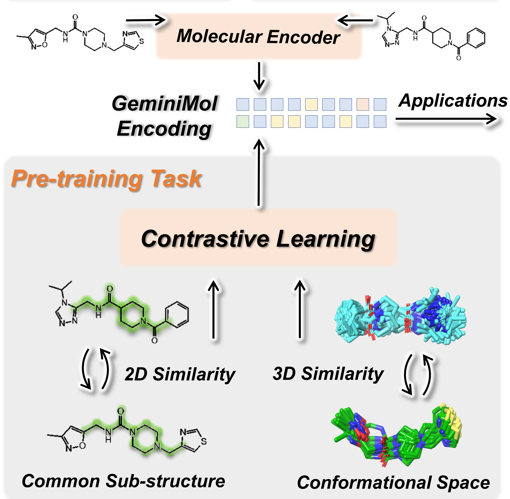
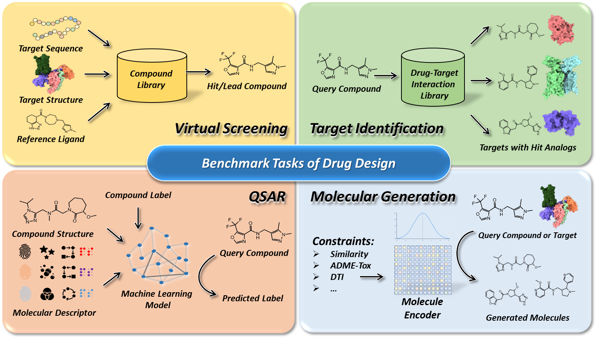

<h1 align="left">  GeminiMol  </h1>
<h3 align="left"> Conformational Space Profile Enhanced Molecular Representation Learning </h3>
<p align="left">
  📃 <a href="https://www.biorxiv.org/content/10.1101/2023.12.14.571629" target="_blank">Paper</a> ·  🤗 <a href="https://huggingface.co/AlphaMWang/GeminiMol" target="_blank">Model</a><br>
</p>

- [💡 Highlight](#-highlight)
- [💗 Motivation](#-motivation)
- [🔔 News](#-news)
- [📕 Installation](#-installation)
  - [Download datasets and models](#download-datasets-and-models)
  - [Installing the dependency packages](#installing-the-dependency-packages)
- [👐 Reproducing](#-reproducing)
- [📓 Application](#-application)
  - [Virtual Screening and Target Identification](#virtual-screening-and-target-identification)
  - [Molecular Proptery Modeling (QSAR and ADMET)](#molecular-proptery-modeling-qsar-and-admet)
- [⭐ Citing this work](#-citing-this-work)
- [✅ License](#-license)
- [💌 Get in Touch](#-get-in-touch)
- [😃 Acknowledgements](#-acknowledgements)
  
    

This repository provides the official implementation of the GeminiMol model, training data, and utitiles.     

We also provide:   

1.  scripts for training, test, and application of GeminiMol models.   
2.  scripts for features analysis, visualisation and similarity calculation.   
3.  scripts, datasets and results for benchmarking molecular fingerprints and GeminiMol models on virtual screening, target identification, and QSAR (drug-target binding affinity, cellar activity, ADME, and toxicity).    

Please also refer to our paper for a detailed description of GeminiMol.    

## 💡 Highlight

* By capturing the intricate interplay between molecular structure and conformational space, our training strategy enhances the representational capacity of GeminiMol.    
* GeminiMol was pre-trained on only 37,336 molecular structures, yet it can generalize to zero-shot and QSAR tasks involving millions of molecules.    
* GeminiMol exhibits the capability to identify pairs of molecules with similar 3D active conformation, even in scenarios where their 2D structures exhibit significant differences.    

## 💗 Motivation  

The **molecular representation model** is an emerging artificial intelligence technology for extracting features of small molecules. It has been **widely applied in drug discovery scenarios**, such as **virtual screening**, Quantitative Structure-Activity Relationship (**QSAR**) analysis, and **ADMET propteries prediction**. In previous work, molecular representation models were mostly trained on the static structure of molecules, however, the small molecules in solution are highly dynamic, and their flexible conformational changes endow them with the potential to bind to drug targets. Therefore, introducing information on small molecule conformational space into molecular representation models is a promising aim. In this work, a training strategy, named GeminiMol, was proposed to **incorporate the comprehension of conformational space into the molecular representation model**.    

## 🔔 News    

* 2023-12, our paper has been uploaded to BioRxiv, you can find it [here](https://www.biorxiv.org/content/10.1101/2023.12.14.571629).    

## 📕 Installation

GeminiMol is a pytorch-based AI model. To set up the GeminiMol model, we recommend using conda for Python environment configuration.   

> Installing MiniConda (skip if conda was installed)   

``` shell
    wget https://repo.continuum.io/miniconda/Miniconda3-latest-Linux-x86_64.sh
    sh Miniconda3-latest-Linux-x86_64.sh
```

> Creating GeminiMol environment   

``` shell
    conda create -n GeminiMol python=3.8.16
    conda activate GeminiMol
```

> Setting up GeminiMol PATH and configuration   
 
``` shell
    git clone https://github.com/Wang-Lin-boop/GeminiMol
    cd GeminiMol/
    echo "# GeminiMol" >> ~/.bashrc
    echo "export PATH=\"${PWD}:\${PATH}\"" >> ~/.bashrc # optional, not required in the current version
    echo "export GeminiMol=\"${PWD}\"" >> ~/.bashrc
    cd geminimol/
    echo "export geminimol_app=\"${PWD}\"" >> ~/.bashrc    
    cd ../models/   
    echo "export geminimol_lib=\"${PWD}\"" >> ~/.bashrc  
    cd ../data/
    echo "export geminimol_data=\"${PWD}\"" >> ~/.bashrc
    source ~/.bashrc
```

### Download datasets and models

In this repository, we provide all the training, validation, and testing datasets used in our paper, as well as an optimal GeminiMol binary-encoder model, a series of CSS similarity decoder models, a molecular structure decoder model, and a variety of decoder models of basic ADMET properties.  

> Download all datasets via Zenodo for training, benchmarking, and applications   

``` shell
    cd ${GeminiMol}/data
    wget https://zenodo.org/api/records/10273480/files-archive 
    for i in Benchmark*.zip css*.zip Chem*.zip;do
        mkdir ${i%%.zip}
        unzip -d ${i%%.zip}/ $i
    done
    unzip -d compound_library/ ChemDiv.zip 
    unzip -d compound_library/ BindingDB_DATA.zip 
```

> Download model parameters and weights via [Google Driver](https://drive.google.com/drive/folders/183WGytS-zy_POlLxEvijEtarow56zmnz?usp=drive_link) and [HuggingFace](https://huggingface.co/AlphaMWang)

Then, we need place the models to the `${GeminiMol}/models`.   

The expected structure of GeminiMol path is:

```
GeminiMol
├── geminimol                            # all code for GeminiMol and CrossEncoder
│   ├── model                            # code for GeminiMol and CrossEncoder models
│   │   ├── CrossEncoder.py              # model and methods for CrossEncoder     
│   │   ├── GeminiMol.py                 # model and methods for GeminiMol models  
│   ├── utils                            # utils in this work
│   │   ├── chem.py                      # basic tools for cheminformatics 
│   │   ├── dataset_split.py             # tools for dataset split 
│   │   ├── fingerprint.py               # basic tools for molecular fingerprints 
│   ├── Analyzer.py                      # analysis given molecules using presentation methods
│   ├── AutoQSAR.py                      # molecular proptery modeling by AutoGluon     
│   ├── PropDecoder.py                   # molecular proptery modeling by our PropDcoder
│   ├── FineTuning.py                    # molecular proptery modeling by fine-tune GeminiMol models
│   ├── Screener.py                      # screening molecules by GeminiMol similarity     
│   ├── CrossEncoder_Training.py         # scripts for training the CrossEncoders.
│   ├── GeminiMol_Training.py            # scripts for training the GeminiMol models.                 
│   ├── benchmark.py                     # benchmarking presentation methods on provide datasets
├── data                                 # training and benchmark data in this work
│   ├── Benchmark_DUD-E                  # virtual screeening         
│   ├── Benchmark_LIT-PCBA               # virtual screeening            
│   ├── Benchmark_TIBD                   # target identification    
│   ├── Benchmark_QSAR                   # QSAR and ADMET        
│   ├── Chem_SmELECTRA                   # text backbone of chemical language 
│   ├── css_library                      # CSS training data
│   ├── benchmark.json                   # dataset index for benchmark tasks         
│   ├── database.csv                     # molecular datasets in this work      
│   ├── BindingDB_DATA.csv               # dataset used in target identification    
│   ├── ChemDiv.csv                      # library of common commercial compounds     
│   ├── Specs.csv                        # library of common commercial compounds    
├── models                               # CrossEncoder and GeminiMol models
│   ├── CrossEncoder                     # CrossEncoder                            
│   ├── GeminiMol                        # GeminiMol, recommended for zero-shot tasks   
│   ├── GeminiMol-MOD                    # GeminiMol-MOD, recommended for QSAR tasks    
``` 

### Installing the dependency packages

If you intend to utilize molecular fingerprint baseline methods or conduct QSAR benchmarking, it is required to install RDKit and AutoGluon in advance.     

> Installing the RDkit for generating fingerprints

``` shell
    pip install rdkit
```

> Installing the AutoGluon for performing AutoQSAR

``` shell
    pip3 install -U pip
    pip3 install -U setuptools wheel
    pip3 install torch==1.13.1+cu116 torchvision==0.14.1+cu116 \
        --extra-index-url https://download.pytorch.org/whl/cu116
    pip3 install autogluon==0.8.1
```

> Installing the statatics and plot packages

``` shell
    pip install oddt scikit-learn matplotlib
```

To re-train the model or make predictions using the models we provide, follow the steps below to install the dependencies in advance.

> Installing the dependency packages of GeminiMol    

``` shell
    pip install scipy dgllife
    pip install torch==1.13.1+cu116 torchvision==0.14.1+cu116 \
        --extra-index-url https://download.pytorch.org/whl/cu116
    pip install dgl -f https://data.dgl.ai/wheels/cu116/repo.html
    pip install dglgo -f https://data.dgl.ai/wheels-test/repo.html
```

## 👐 Reproducing

Here, we present the reproducible code for training the Cross-Encoder and GeminiMol models based on the conformational space similarity descriptors of 39,290 molecules described in the paper.    
Additionally, benchmark test scripts were provided. With this code, the community can reproduce the results reported in the paper, explore different model architectures, or incorporate additional molecular similarity data to further enhance the performance of the models.  

> Training the Cross-Encoder

``` shell
conda activate GeminiMol
export model_name="CrossEncoder"
export batch_size_per_gpu=200 # batch size = 200 (batch_size_per_gpu) * 4 (gpu number)
export epoch=20 # max epochs
export lr="1.0e-3" # learning rate
export label_list="MCMM1AM_MAX:LCMS2A1Q_MAX:MCMM1AM_MIN:LCMS2A1Q_MIN" # ShapeScore:ShapeAggregation:ShapeOverlap:CrossSim:CrossAggregation:CrossOverlap
CUDA_VISIBLE_DEVICES=0,1,2,3 python ${geminimol_app}/CrossEncoder_Training.py  "${geminimol_data}/css_library/" "${geminimol_data}/Chem_SmELECTRA"  "${epoch}"  "${lr}"  "${batch_size_per_gpu}"  "${model_name}"  "${geminimol_data}/benchmark.json" "${label_list}"
```

> Training the GeminiMol Encoder

``` shell
conda activate GeminiMol
export model_name="GeminiMol"
export batch_size=512
export epoch=20 # max epochs
export patience=50 # for early stoping
export GNN='WLN' # Weisfeiler-Lehman Network (WLN)
export network="MeanMLP:2048:4:2048:None:0:5:0" # "Weighted:1024:12:2048:None:0:5:0" for GeminiMol-MOD
export label_dict="ShapeScore:0.2,ShapeAggregation:0.2,ShapeOverlap:0.05,ShapeDistance:0.05,CrossSim:0.15,CrossAggregation:0.15,CrossDist:0.05,CrossOverlap:0.05,MCS:0.1"
CUDA_VISIBLE_DEVICES=0 python -u ${geminimol_app}/GeminiMol_Training.py "${geminimol_data}/css_library/" "${epoch}" "${batch_size}" "${GNN}" "${network}" "${label_dict}" "${model_name}" "${patience}" "${geminimol_data}/benchmark.json" 
```

> Benchmarking molecular fingerprints and our models

``` shell
conda activate GeminiMol
# benchmarking Fixed GeminiMol models and Fingerprints
for task in "DUDE" "LIT-PCBA" "TIBD" \
    "ADMET-C" "ADMET-R" \ 
    "LIT-QSAR" "CELLS-QSAR" "ST-QSAR" "PW-QSAR" \ 
    "PropDecoder-ADMET" "PropDecoder-QSAR"
    do
for model_name in "CombineFP" \
    "FCFP6" "MACCS" "RDK" "ECFP6" "FCFP4" "TopologicalTorsion" "AtomPairs" "ECFP4" \
    "${geminimol_lib}/GeminiMol" "${geminimol_lib}/GeminiMol-MOD"
    do
mkdir -p ${model_name}
CUDA_VISIBLE_DEVICES=0 python -u ${geminimol_app}/benchmark.py "${model_name}" "${geminimol_data}/benchmark.json"  "${task}"
done
done
# benchmarking FineTuning GeminiMol models
for task in "FineTuning-ADMET" "FineTuning-QSAR"; do
for model_name in "${geminimol_lib}/GeminiMol" "${geminimol_lib}/GeminiMol-MOD"; do
CUDA_VISIBLE_DEVICES=0 python -u ${geminimol_app}/benchmark.py "${model_name}" "${geminimol_data}/benchmark.json"  "${task}"
done
done
```

## 📓 Application

As a molecular representation model, GeminiMol finds applications in **ligand-based virtual screening, target identification, and quantitative structure-activity relationship (QSAR)** modeling of small molecular drugs.   



We have provided Cross-Encoder and GeminiMol models that can be used directly for inference. Here, we demonstrate the utilization of GeminiMol for virtual screening, target identification, and molecular property modeling.       

### Virtual Screening and Target Identification

In concept, molecules share similar conformational space also share similar biological activities, allowing us to predict the similarity of biological activities between molecules by comparing the similarity of GeminiMol encodings. Here, we introduce the ``PharmProfiler.py``, a novel approach that employs the GeminiMol encoding to establish pharmacological profiles and facilitate the search for molecules with specific properties in chemical space. ``PharmProfiler.py`` offers the capability to conduct ligand-based virtual screening using commercially available compound libraries. Furthermore, it enables target identification through ligand similarity analysis by leveraging comprehensive drug-target relationship databases. To support experimentation, we have included a collection of diverse commercial compound libraries and drug-target relationship databases, conveniently located in the `${geminimol_data}/compound_library/` directory.     

> Prepare the pharmacological profile and compound libraries

To define a pharmacological profile, you will need to input a `profile.csv` file, which should have the following format:   

``` 
SMILES,Label
C=CC(=O)N[C@@H]1CN(c2nc(Nc3cn(C)nc3OC)c3ncn(C)c3n2)C[C@H]1F,1.0
C=CC(=O)Nc1cccc(Nc2nc(Nc3ccc(N4CCN(C(C)=O)CC4)cc3OC)ncc2C(F)(F)F)c1,1.0
C#Cc1cccc(Nc2ncnc3cc(OCCOC)c(OCCOC)cc23)c1,1.0
COC(=O)CCC/N=C1\SCCN1Cc1ccccc1,0.4
C=C(C)[C@@H]1C[C@@H](CC2(CC=C(C)C)C(=O)C(C(CC(=O)O)c3ccccc3)=C3O[C@@H](C)[C@@H](C)C(=O)C3=C2O)C1(C)C,-0.8
C/C(=C\c1ncccc1C)[C@@H]1C[C@@H]2O[C@]2(C)CCC[C@H](C)[C@H](O)[C@@H](C)C(=O)C(C)(C)[C@@H](O)CC(=O)O1,-0.5
```

The "Label" column signifies the weight assigned to the reference compound. Positive values indicate that the selected compounds should bear resemblance to the reference compound, while negative values imply that the selected compounds should be dissimilar to the reference compound. Typically, positive values are assigned to **active** compounds, whereas negative values are assigned to **inactive** compounds or those causing **side effects**.   

The compound libraries are also stored in CSV format in the `${geminimol_data}/compound_library/` directory. When conducting screening, it is essential to specify the column name that represents the compound structures in the library, typically referred to as the SMILES column. It is recommended to maintain consistency between the SMILES column name in the `profile.csv` file and the compound library. For the provided commercial compound libraries, the column name is "SMILES", whereas for the drug-target relationship databases, the column name is "Ligand_SMILES".   

> Perform the PharmProfiler

To perform virtual screening, the following command can be used.   

Here, `profile_set` represents the provided pharmacological profile by the user, `keep_top` indicates the number of compounds to be outputted in the end, and `probe_cluster` determines whether compounds with the same weight should be treated as a cluster. Compounds within the same cluster will be compared individually with the query mol, and the highest similarity score will be taken as the score of query mol.   

We have provided a processed version of the commercial Specs and ChemDiv compound library at the `${geminimol_data}/compound_library/specs.csv` and `${geminimol_data}/compound_library/ChemDiv.csv`, which contained 335,212 and 1,755,930 purchasable compounds.   

``` shell
export job_name="Virtual_Screening"
export profile_set="profile.csv" # SMILES, Title, and Label (optional)
export compound_library="${geminimol_data}/compound_library/ChemDiv.csv" 
export smiles_column="SMILES" # Specify the column name in the compound_library
export keep_top=1000
export probe_cluster="Yes"
CUDA_VISIBLE_DEVICES=0 python -u ${geminimol_app}/PharmProfiler.py "${geminimol_lib}/GeminiMol" "${job_name}" "${smiles_column}" "${compound_library}" "${profile_set}" "${keep_top}"  "${probe_cluster}"
```

To perform target identification, the compound library can be replaced with the `${geminimol_data}/compound_library/BindingDB_DATA.csv`, which contains drug-target relationships. This is a processed version of the BindingDB database, which contains 2,159,221 target-ligand paris. When applying the same profile file for target identification as mentioned above, it is necessary to modify the SMILES column name to "Ligand_SMILES" to match those in the `BindingDB_DATA.csv`. Of course, you may consider altering the column name in `BindingDB_DATA.csv` to "SMILES".    

``` shell
export job_name="Target_Identification"
export profile_set="profile.csv" # SMILES, Title, and Label (optional)
export compound_library="${geminimol_data}/compound_library/BindingDB_DATA.csv" 
export smiles_column="Ligand_SMILES" # Specify the column name in the compound_library
export keep_top=2000
export probe_cluster="No"
CUDA_VISIBLE_DEVICES=0 python -u ${geminimol_app}/PharmProfiler.py "${geminimol_lib}/GeminiMol" "${job_name}" "${smiles_column}" "${compound_library}" "${profile_set}" "${keep_top}"  "${probe_cluster}"
```

After the initial run of PharmProfiler, a extracted GeminiMol feature file will be generated in the `${geminimol_data}/compound_library/`. Subsequent screening tasks on the same compound library can benefit from PharmProfiler automatically reading the feature file, which helps to accelerate the running speed.    

### Molecular Proptery Modeling (QSAR and ADMET)

> Prepare your datasets

Before conducting molecular property modeling, it is crucial to carefully prepare your data, which includes compound structure pre-processing and dataset splitting.     

Firstly, you need to clarify the chirality and protonation states of molecules in the dataset, which can be done using chemical informatics tools such as RDKit or Schrödinger software package. The processed data should be saved in CSV file format, containing at least one column for **SMILES** and one column for **Labels**. Subsequently, utilize the following command for skeleton splitting. You can modify the script to change the splitting ratio, where by default, 70% of the dataset is used for training and 30% for validation and testing.     

``` shell
export dataset_path="data.csv"
export dataset_name="My_QSAR"
export smiles_column="SMILES" # Specify the column name in datasets
export label_column="Label" # Specify the column name in datasets
python -u ${geminimol_app}/utils/dataset_split.py "${dataset_path}" "${dataset_name}" "${smiles_column}" "${label_column}"
mkdir ${dataset_name}
mv ${dataset_name}_scaffold_*.csv ${dataset_name}/
export task=${dataset_name}
```

We have presented three approaches for molecular property modeling, namely AutoQSAR (broad applicability, slow speed), PropDecoder (fast speed), and FineTuning (optimal performance, moderate speed).     

In the majority of instances, the attainment of optimal performance can be accomplished through the utilization of the FineTuning script to invoke GeminiMol.     

> Fine-Tuning on downstream task     

``` shell
export task="Your_Dataset" # Specify a path to your datasets (train, valid, and test)
export smiles_column="SMILES" # Specify the column name in datasets
export label_column="Label" # Specify the column name in datasets
CUDA_VISIBLE_DEVICES=${gpu_id} python -u ${geminimol_app}/FineTuning.py "${task}" "${geminimol_lib}/GeminiMol" "${smiles_column}" "${label_column}" "${task}_GeminiMol"
```

If the integration of molecular fingerprints and a pre-trained GeminiMol model is desired for training a molecular property prediction model, either PropDecoder or AutoQSAR can be employed.   

> PropDecoder    

``` shell
export task="Your_Dataset" # Specify a path to your datasets (train, valid, and test)
export fingerprints="ECFP4:AtomPairs:TopologicalTorsion:FCFP6:MACCS"
export smiles_column="SMILES" # Specify the column name in datasets
export label_column="Label" # Specify the column name in datasets
CUDA_VISIBLE_DEVICES=${gpu_id} python -u ${geminimol_app}/PropDecoder.py "${task}" "${geminimol_lib}/GeminiMol:${fingerprints}" "${smiles_column}" "${label_column}" "${task}_GeminiMol"
```

> AutoQSAR (AutoGluon)    

``` shell
export task="Your_Dataset" # Specify a path to your datasets (train, valid, and test)
export fingerprints="ECFP4:AtomPairs:TopologicalTorsion:FCFP6:MACCS"
export smiles_column="SMILES" # Specify the column name in datasets
export label_column="Label" # Specify the column name in datasets
CUDA_VISIBLE_DEVICES=${gpu_id} python -u ${geminimol_app}/AutoQSAR.py "${task}" "${geminimol_lib}/GeminiMol:${fingerprints}" "${smiles_column}" "${label_column}" "" "${task}_GeminiMol"
```

## ⭐ Citing this work

**Conformational Space Profile Enhances Generic Molecular Representation Learning**     
Lin Wang, Shihang Wang, Hao Yang, Shiwei Li, Xinyu Wang, Yongqi Zhou, Siyuan Tian, Lu Liu, Fang Bai    
bioRxiv 2023.12.14.571629; doi: https://doi.org/10.1101/2023.12.14.571629    

## ✅ License

GeminiMol is released under the Academic Free Licence, which permits academic use, modification and distribution free of charge, but prohibits unauthorised commercial use, including commercial training and as part of a paid computational platform. However, communication and authorization with [our supervisor](baifang@shanghaitech.edu.cn) is permitted for its application in pipeline development and research activities within pharmaceutical R&D.     

## 💌 Get in Touch

We welcome community contributions of extension tools based on the GeminiMol model, etc. If you have any questions not covered in this overview, please contact the [GeminiMol Developer Team](wangl@shanghaitech.edu.cn). We would love to hear your feedback and understand how GeminiMol has been useful in your research. Share your stories with us at wangl@shanghaitech.edu.cn or baifang@shanghaitech.edu.cn.       

In addition to GitHub, we offer a WeChat community to provide a forum for discussion between users. You can access the community's QR code by following the "蛋白矿工" on WeChat.     

## 😃 Acknowledgements

We appreciate the technical support provided by the engineers of the high-performance computing cluster of ShanghaiTech University.  Lin Wang also thanks Jianxin Duan, Gaokeng Xiao, Quanwei Yu, Zheyuan Shen, Shenghao Dong, Huiqiong Li, Zongquan Li, and Fenglei Li for providing technical support, inspiration and help for this work.      

We appreciate the developers of AutoGluon and Deep Graph Library (DGL). We also thank the developers and maintainers of MarcoModel and PhaseShape modules in the Schrödinger package.      

Besides, GeminiMol communicates with and/or references the following separate libraries and packages, we thank all their contributors and maintainers!  

*  [_RDKit_](https://www.rdkit.org/)
*  [_PyTorch_](https://pytorch.org/)
*  [_AutoGluon_](https://auto.gluon.ai/stable/index.html)
*  [_DGL-Life_](https://lifesci.dgl.ai/)
*  [_ODDT_](https://oddt.readthedocs.io/en/latest/)
*  [_SciPy_](https://scipy.org/)
*  [_scikit-learn_](https://scikit-learn.org/stable/)
*  [_matplotlib_](https://matplotlib.org/)

