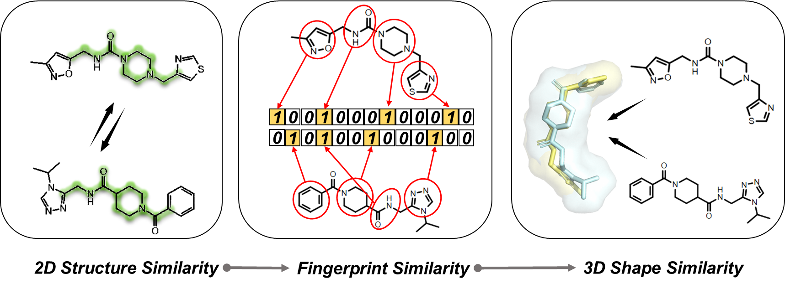

# GeminiMol

  

This repository provides the official implementation of the GeminiMol model, training data, and utitiles.  

We also provide:   

1.  scripts for data collection, partitioning and analysis.    
2.  scripts for features analysis, visualisation and similarity calculation.   
3.  scripts, datasets and results for benchmarking molecular fingerprints and GeminiMol models on virtual screening, target identification, and QSAR (drug-target binding affinity, cellar activity, ADME, and toxicity).    

_Please also refer to our paper for a detailed description of GeminiMol._

## Motivation  

_The **molecular representation model** is an emerging artificial intelligence technology for extracting features of small molecules. It has been **widely applied in drug discovery scenarios**, such as **virtual screening**, Quantitative Structure-Activity Relationship (**QSAR**) analysis, and **ADMET propteries prediction**._   
  
_In previous work, molecular representation models were mostly trained on the static structure of molecules, however, the small molecules in solution are highly dynamic, and their flexible conformational changes endow them with the potential to bind to drug targets. Therefore, introducing information on small molecule conformational space into molecular representation models is a promising aim. In this work, a training strategy, named GeminiMol, was proposed to **incorporate the comprehension of conformational space into the molecular representation model**._   

_The similarity between small molecules provides the opportunity for contrastive learning, as illustrated in followed figure, the shape similarity contained more pharmacological and physical information than the 2D structure and fingerprint similarity, therefore, **introducing the molecular shape similarity in contrastive learning is a promising strategy**._



_In this study, a diverse collection of **39,290** molecules was employed for conformational searching and shape alignment to generate a comprehensive dataset of molecular conformational space similarity. Various hyperparameters were employed during the conformational search process, and a multi-task learning approach was adopted to facilitate the model in acquiring a universal representation of molecular conformational space. To assess the model's performance, the **benchmark datasets comprising over millions molecules** was utilized for downstream tasks._    

## Installation

_GeminiMol is a pytorch-based AI model. To set up the GeminiMol model, we recommend using conda for Python environment configuration._   

> Installing MiniConda (Can be skipped if conda is installed)   

``` shell
    wget https://repo.continuum.io/miniconda/Miniconda3-latest-Linux-x86_64.sh
    sh Miniconda3-latest-Linux-x86_64.sh
```

> Creating GeminiMol env   

``` shell
    conda create -n GeminiMol python=3.8.16
    conda activate GeminiMol
```

> Setting up GeminiMol and configuration   
 
``` shell
    git clone https://github.com/Wang-Lin-boop/GeminiMol
    cd GeminiMol/
    export PATH=${PWD}:\$PATH" >> ~/.bashrc
    export GeminiMol=${PWD}" >> ~/.bashrc
    cd geminimol/
    export geminimol_app=${PWD}" >> ~/.bashrc    
    cd ../model/   
    export geminimol_lib=${PWD}" >> ~/.bashrc  
    cd ../data/
    export geminimol_data=${PWD}" >> ~/.bashrc
    source ~/.bashrc
```

### Download datasets and models

_In this repository, we provide all the training, validation, and testing datasets used in our paper, as well as an optimal GeminiMol binary-encoder model, a series of CSS similarity decoder models, a molecular structure decoder model, and a variety of decoder models of basic ADMET properties._  

> Download all datasets, model parameters and weights via Zenodo

``` shell
    cd ${GeminiMol}/
    wget 
    unzip *
    mv Benchmark_* data/
    mv css_library data/
    mv BindingDB_DATA.csv data/
    mv GeminiMol* models/
    mv CrossEncoder models/
    mv Chem_SmELECTRA models/
```

### Installing the dependency packages

_If you intend to utilize molecular fingerprint baseline methods or conduct QSAR benchmarking, it is required to install RDKit and AutoGluon in advance._     

> Installing the RDkit for generating fingerprints

``` shell
    pip install rdkit
```

> Installing the AutoGluon for performing AutoQSAR

``` shell
    pip3 install -U pip
    pip3 install -U setuptools wheel
    pip3 install torch==1.13.1+cu116 torchvision==0.14.1+cu116 \
        --extra-index-url https://download.pytorch.org/whl/cu116
    pip3 install autogluon==0.8.1
```

> Installing the statatics and plot packages

``` shell
    pip install oddt scikit-learn matplotlib umap-learn
```

_To re-train the model or make predictions using the models we provide, follow the steps below to install the dependencies in advance._

> Installing the dependency packages of GeminiMol    

``` shell
    pip install rdkit scipy dgllife scikit-learn
    pip install torch==1.13.1+cu116 torchvision==0.14.1+cu116 \
        --extra-index-url https://download.pytorch.org/whl/cu116
    pip install dgl -f https://data.dgl.ai/wheels/cu116/repo.html
    pip install dglgo -f https://data.dgl.ai/wheels-test/repo.html
```

## Reproducing

### Training the Cross-Encoder


``` shell
conda activate GeminiMol
export model_name="CrossEncoder"
export batch_size_per_gpu=200 # batch size = 200 (batch_size_per_gpu) * 4 (gpu number)
export epoch=20 # max epochs
export lr="1.0e-3" # learning rate
export label_list="MCMM1AM_MAX:LCMS2A1Q_MAX:MCMM1AM_MIN:LCMS2A1Q_MIN" # ShapeScore:ShapeAggregation:ShapeOverlap:CrossSim:CrossAggregation:CrossOverlap
CUDA_VISIBLE_DEVICES=0,1,2,3 python ${geminimol_app}/CrossEncoder_Training.py  "${geminimol_data}/css_library/" "${geminimol_data}/Chem_SmELECTRA"  "${epoch}"  "${lr}"  "${batch_size_per_gpu}"  "${model_name}"  "${geminimol_data}/benchmark.json" "${label_list}"
```

### Training the GeminiMol Encoder

``` shell
conda activate GeminiMol
export model_name="GeminiMol"
export batch_size=512
export epoch=20 # max epochs
export patience=50 # for early stoping
export GNN='WLN' # Weisfeiler-Lehman Network (WLN)
export network="MeanMLP:2048:4:2048:None:0:5:0" # "Weighted:1024:12:2048:None:0:5:0" for GeminiMol-MOD
export label_dict="ShapeScore:0.2,ShapeAggregation:0.2,ShapeOverlap:0.05,ShapeDistance:0.05,CrossSim:0.15,CrossAggregation:0.15,CrossDist:0.05,CrossOverlap:0.05,MCS:0.1"
CUDA_VISIBLE_DEVICES=0 python -u ${geminimol_app}/GeminiMol_Training.py "${geminimol_data}/css_library/" "${epoch}" "${batch_size}" "${GNN}" "${network}" "${label_dict}" "${model_name}" "${patience}" "${geminimol_data}/benchmark.json" 
```

### Benchmarking molecular fingerprints and our models

``` shell
conda activate GeminiMol
# benchmarking Fixed GeminiMol models and Fingerprints
for task in "DUDE" "LIT-PCBA" "TIBD" \
    "ADMET-C" "ADMET-R" \ 
    "LIT-QSAR" "CELLS-QSAR" "ST-QSAR" "PW-QSAR" \ 
    "PropDecoder-ADMET" "PropDecoder-QSAR"
    do
for model_name in "CombineFP" \
    "FCFP6" "MACCS" "RDK" "ECFP6" "FCFP4" "TopologicalTorsion" "AtomPairs" "ECFP4" \
    "${geminimol_lib}/GeminiMol" "${geminimol_lib}/GeminiMol-MOD"
    do
mkdir -p ${model_name}
CUDA_VISIBLE_DEVICES=0 python -u ../geminimol/benchmark.py "${model_name}" "${geminimol_data}/benchmark.json"  "${task}"
done
done
# benchmarking FineTuning GeminiMol models
for task in "FineTuning-ADMET" "FineTuning-QSAR"; do
for model_name in "${geminimol_lib}/GeminiMol" "${geminimol_lib}/GeminiMol-MOD"; do
CUDA_VISIBLE_DEVICES=0 python -u ../geminimol/benchmark.py "${model_name}" "${geminimol_data}/benchmark.json"  "${task}"
done
done
```

## Application

_As a molecular representation model, GeminiMol finds applications in **ligand-based virtual screening, target identification, and quantitative structure-activity relationship (QSAR)** modeling of small molecular drugs. Moreover, by exploring the encoding space of GeminiMol, it enables **scaffold hopping** and facilitates the generation of innovative molecules._   


_To ensure the accurate evaluation of the model's performance, we have additionally devised a competitive-performance baseline method utilizing molecular fingerprints. This baseline method has demonstrated competitive performance compared to state-of-the-art traditional methods in the application tasks. GeminiMol has demonstrated comparable or even superior performance compared to the current state-of-the-art baseline method in various statistical metrics across these tasks. Furthermore, it demonstrates a remarkable ability to attain balanced superior performance across multiple diverse tasks **without the necessity of additional fine-tuning or hyperparameter readjustment**._

## Applying GeminiMol into drug discovery

_We have provided Cross-Encoder and GeminiMol models that can be used directly for inference. For common drug discovery tasks, you can make predictions with the following commands._

#### Virtual Screening


#### Target Identification


#### Molecular Proptery Modeling (QSAR and ADMET)


## Citing this work

_Coming in soon...._

## Get in Touch

_In addition to GitHub, we offer a WeChat community to provide a forum for discussion between users. You can access the community's QR code by following the "蛋白矿工" on WeChat._    

_If you have any questions not covered in this overview, please contact the GeminiMol team at wanglin3@shanghaitech.edu.cn. We would love to hear your feedback and understand how GeminiMol has been useful in your research. Share your stories with us at wanglin3@shanghaitech.edu.cn or baifang@shanghaitech.edu.cn._    

## Acknowledgements

_We appreciate the technical support provided by the engineers of the high-performance computing cluster of ShanghaiTech University. Lin Wang also thanks Jianxin Duan, Gaokeng Xiao, Quanwei Yu, Shiwei Li and Fenglei Li for providing technical support, inspiration and help for this work. We appreciate the developers of AutoGluon and Deep Graph Library (DGL), and we thank for the RetNet implementations provided by Jamie Stirling and Frank Odom. We also thank the developers and maintainers of MarcoModel and PhaseShape modules in the Schrödinger package. Besides, GeminiMol communicates with and/or references the following separate libraries and packages, we thank all their contributors and maintainers!_  

*  [_RDKit_](https://www.rdkit.org/)
*  [_PyTorch_](https://pytorch.org/)
*  [_AutoGluon_](https://auto.gluon.ai/stable/index.html)
*  [_DGL-Life_](https://lifesci.dgl.ai/)
*  [_ODDT_](https://oddt.readthedocs.io/en/latest/)
*  [_SciPy_](https://scipy.org/)
*  [_scikit-learn_](https://scikit-learn.org/stable/)
*  [_matplotlib_](https://matplotlib.org/)

